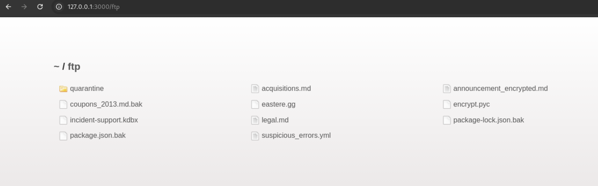

## OWASP Juice Shop: Початковий посібник з веб-безпеки

**OWASP Juice Shop** — це один із найкращих сучасних інструментів для вивчення веб-безпеки. Це навмисно вразливий додаток, написаний на Node.js, Express та Angular. Оскільки він містить понад 100 челенджів, цей посібник допоможе вам пройти перші ключові етапи та зрозуміти логіку гри.

### 1. Підготовка (Setup)

Найкращий спосіб запустити додаток локально — через Docker. Це забезпечує ізоляцію та швидкий старт.

1. Встановіть Docker.
2. Виконайте команду в терміналі:
    `docker run --rm -p 3000:3000 bkimminich/juice-shop`
Маємо наступний результат:
![[Screenshot_2026-07-30_00-53-08.png]]

3. Відкрийте браузер за адресою: **http://localhost:3000**
![[Screenshot_2026-07-30_00-55-11.png]]


### 2. Перший крок: Пошук дошки результатів (Score Board)

У Juice Shop посилання на список завдань приховане. Ваше перше завдання — знайти його самостійно.

* **Завдання:** Знайти сторінку зі списком усіх челенджів.
* **Як пройти:** Спробуйте вгадати URL (наприклад, перевірте `/score-board` або `/scoreboard`). Розробники часто ховають такі технічні сторінки в коді або через роутинг. Зазвичай багато цікавого можна знайти у файлі `main.js`. Тобто натискаємо F12, відкривається інспектор і далі шукаємо в коді щось схоже на **scoreboard**. Отримуємо наступний результат:

![[Screenshot_2026-07-30_00-57-07.png]]


* **Пряме посилання:** http://localhost:3000/#/score-board

### 3. Рівень 1: Базові вразливості

#### Атака на пошуковий рядок (DOM XSS)
* **Завдання:** Виконати XSS-атаку.
* **Як пройти:** У полі пошуку (Search) вгорі сторінки введіть скрипт:
    `<iframe src="javascript:alert('xss')">`
* **Результат:** Має з'явитися вікно з повідомленням, після чого челендж буде зараховано.
![[Screenshot_2026-07-30_00-58-56.png]]
* **Додатково** робимо відправку пейлоада
![[Screenshot_2026-07-30_01-00-08.png]]
* Знайдемо політику приватності таким самим чином як і score-board
	![[Screenshot_2026-07-30_01-05-43.png]]

#### Витік конфіденційних даних (Sensitive Data Exposure)
* **Завдання:** Знайти файл, який не має бути публічним.
Спочатку шукаємо відкриті директорії, але отримуємо помилку:
![[Screenshot_2026-07-30_01-08-21.png]]
Вносимо зміни, які нам рекомендовано, та знову запускаємо сканування:
![[Screenshot_2026-07-30_01-10-16.png]]
Випадково :-) проходимо *Security misconfiguration*, зламавши *ДжусіШоп*:
![[Screenshot_2026-07-30_01-12-39.png]]
Перезпускаємо контейнер та йдемо до знайденого FTP:


* **Як пройти:** Перейдіть до директорії **http://localhost:3000/ftp**. Там зазвичай знаходяться бекапи або `.md` файли. 
* **Підказка:** Спробуйте завантажити файли, які сервер намагається блокувати, використовуючи обхід фільтрів (наприклад, додаючи `%2500.md` до назви).

![[Screenshot_2026-07-30_01-14-51.png]]
або якийсь інший файл:
![[Screenshot_2026-07-30_01-16-11.png]]

Як результат - пройшли ще декілька завдань:

![[Screenshot_2026-07-30_01-29-54.png]]
### 4. Рівень 2: Злам акаунтів (Authentication)

#### Адмінська панель (SQL Injection)
Це класична атака, яка дозволяє увійти в систему без знання пароля.

1. Перейдіть на сторінку **Login**.
2. Введіть у поле Email: `' or 1=1--`
3. Введіть будь-який пароль.

Має виглядати наступним чином:
![[Screenshot_2026-07-30_01-30-14.png]]

**Чому це працює?**
Запит до бази даних виглядає приблизно так:
$SELECT * FROM Users WHERE email = '' OR 1=1--' AND password = '...'$

Оскільки умова `1=1` завжди істинна, а символи `--` закоментовують решту запиту (перевірку пароля), ви автоматично увійдете під першим користувачем у базі — зазвичай це адміністратор.

### 5. Інструментарій для проходження

Для виконання складніших завдань вам знадобляться:

| Інструмент | Для чого використовувати |
| :--- | :--- |
| **Burp Suite** | Перехоплення та модифікація HTTP-запитів. |
| **Browser DevTools** | Аналіз JavaScript-коду (файл `main.js` містить багато підказок). |
| **FFUF / Gobuster** | Автоматизований пошук прихованих директорій та файлів. |
| **CyberChef** | Декодування Base64, MD5, SHA та інших форматів. |

---
### 6. Виконаємо завдання "Missing encoding"

На фотостіні можемо помітити зображення, яке не прогружається. Через інспектор можна отримати пряме посилання на зображення. Однак навіть так доступу до зображення ми не маємо
![[Screenshot_2026-07-30_22-34-27.png]]
Пряме посилання на зображення
```
http://localhost:3000/assets/public/images/uploads/%E1%93%9A%E1%98%8F%E1%97%A2-#zatschi-#whoneedsfourlegs-1572600969477.jpg
```
Спробуємо замінити `#` на  `%23`
![[Screenshot_2026-07-30_01-45-03.png]]
Завдання виконано
![[Screenshot_2026-07-30_22-49-31.png]]
### 7. Виконаємо завдання "Repetitive Registration"
Для цього переходимо у Burpsuite та запускаємо режим Proxy, але не вмикаємо Intercept. 
Після цього заповнюємо форму реєстрації
![[Screenshot_2026-07-30_16-05-53.png]]
Вмикаємо Intercept
![[Screenshot_2026-07-30_16-06-06.png]]
Та відправляємо запит![[Screenshot_2026-07-30_16-17-28.png]]
В перехопленому запиті міняємо `passwordRepeat` на щось інше. Також, можна поміняти поле `email` на щось інше, наприклад на щось, що навіть не має необхідний формат![[Screenshot_2026-07-30_16-18-00.png]]
Вимикаємо Intercept та надсилаємо таким чином запит. Запит було прийнято та завдання виконано.
Перевіримо профіль користувача та виконане завдання![[Screenshot_2026-07-30_16-18-45.png]]![[Screenshot_2026-07-30_16-20-45.png]]
За таким самим принципом виконаємо завдання "Zero Stars".
Знайдемо форму для заповнення свого відгуку та перехопимо її в Proxy
![[Screenshot_2026-07-30_16-22-07.png]]
Міняємо поле `rating` на 0 та відключаємо Intercept
Відгук з рейтингом 0 відправлений, а завдання виконано
![[Screenshot_2026-07-30_16-23-01.png]]